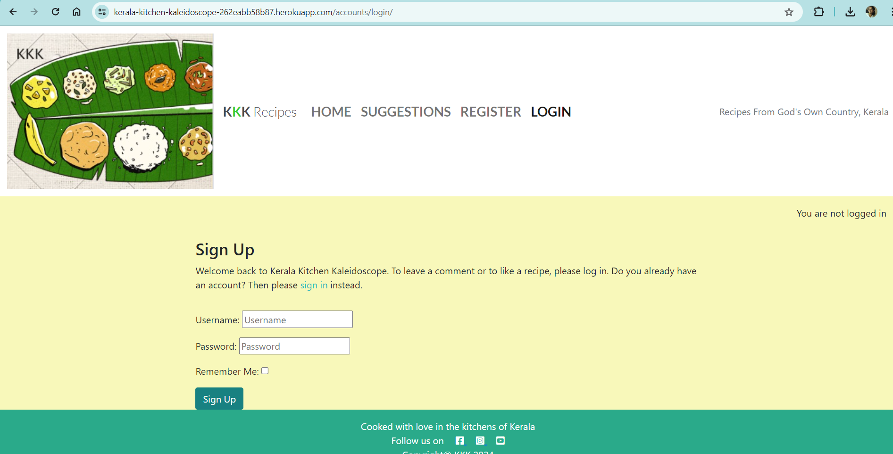
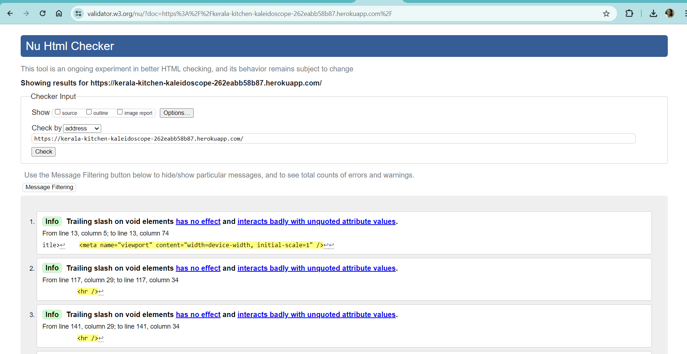
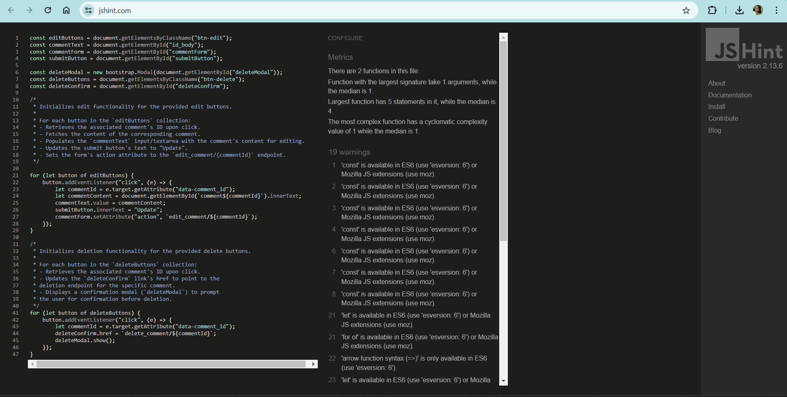

# Kerala Kitchen Kaleidoscope     

Kerala Kitchen Kaleidoscope is a recipe website based on Kerala cuisine. Kerala is a state in southern India. It is called the God's own country and has a flavourful cuisine which is authentic and traditional.    

       

The live website can be accessed here: [Kerala Kitchen Kaleidoscope](https://kerala-kitchen-kaleidoscope-262eabb58b87.herokuapp.com/)

For Admin access (for authorized users only): [Admin Panel](https://kerala-kitchen-kaleidoscope-262eabb58b87.herokuapp.com/admin/login/?next=/admin/)    

# Introduction  

Kerala Kitchen Kaleidoscope is a website featuring recipes from Kerala. Kerala cuisine is a culinary style originated in Kerala, a state on the southwestern Malabar Coast of India. It offers a multitude of both vegetarian and non-vegetarian dishes. Kerala is known as the "Land of Spices" and we use chillies, curry leaves, coconut, mustard seeds, turmeric, tamarind, asafoetida and other spices in the preparation. Having been a major production area of spices for thousands of years, the region makes frequent use of black pepper, cardamom, clove, ginger, and cinnamon.
Kerala Kitchen Kaleidoscope has been developed as part of the Code Institute's Full-Stack Developer course as my fourth project. It is focused on Django and Bootstrap frameworks, database manipulation and CRUD functionality. 
I am born and brought up in Kerala and now living in Germany. I chose this topic for my project as I wanted the world to know about the rich flavours of Kerala cuisine.    

# Table of Contents  

- [Kerala Kitchen Kaleidoscope](#kerala-kitchen-kaleidoscope)
- [Introduction](#introduction)
- [Table of Contents](#table-of-contents)
- [Overview](#overview)
- [UX - User Experience](#ux-user-experience)
     -    [Colour scheme and theme](#colour-scheme-and-theme)  
     -    [Fonts](#fonts)  
- [Design](#design)
     -    [Wireframes](#wireframes)  
     -    [Database Schema - Entity Relationship Diagram](#database-schema-entity-relationship-diagram)  
- [Project Management- Agile Methodologies](#project-management-agile-methodologies)
- [MoSCoW Prioritization](#moscow-prioritization)
- [User Stories](#user-stories)
- [Features](#features)
- [CRUD Functionality](#crud-functionalities)
- [Future Features](#future-features)
- [Technologies & Languages Used](#technologies-&-languages-used)
- [Libraries & Frameworks](libraries-&-frameworks)
- [Testing](#testing)   
     -    [Validator Testing](#validator-testing)  
     -    [Manual Testing](#manual-testing)  
- [Deployment](#deployment)
- [Credits for Content and Media](#credits)

# Overview    

Kerala Kitchen Kaleidoscope is a recipe app for Kerala cuisine. It is accessible via all browsers with full responsiveness on different screen sizes. Kerala Kitchen Kaleidoscope aims to share the authentic dishes from traditional Kerala cuisine with the world. I have currently implemented a first version of this app but in future development of this project, I hope to include more features for the users.    

# UX - User Experience  

+ **Colour scheme and theme**    

The logo of the website is an image icon of Kerala Sadya. While creating the theme of the website, I began by creating an illustration of a banana leaf spread out like a placemat. Then I added various elements of Kerala Sadya dishes onto the banana leaf, such as rice, curries like avial, olan, then pappadam, banana chips, etc. I wanted to bring in the authenticity of Kerala cuisine and the flavours which make it unique.    

I have used vibrant colours commonly found in Kerala cuisine, such as green, yellow, and earthy tones. I used [Canva](https://www.canva.com/) for selecting the colour theme.   

+ **Fonts**   

I have used "Lato" and "Roboto" fonts from the [Google Fonts](https://fonts.google.com/) library as it was giving a nice look for the text content displayed.    

# Design    

+ **Wireframes**    

I used Balsamiq Wireframes (desktop app) to create the wireframe designs for Kerla Kitchen Kaleidoscope.

     

    

+ **Database Schema - Entity Relationship Diagram**    

I used [Draw SQL](https://drawsql.app/) to create Entity Relationship Diagram for Kerla Kitchen Kaleidoscope.    

    

# Project Management- Agile Methodologies   

Kerala Kitchen Kaleidoscope is the first project where I followed Agile planning methods by myself. I had participated in Code Institute's March Hackathon and that experience helped me a lot as I already knew how it works. I used my Github Projects Board to plan and document all of my work. This was a huge a learning experience for me even though I have worked with Agile before in my career. 

# MoSCoW Prioritization  

I followed the MoSCoW Prioritization method for Kerala Kitchen Kaleidoscope by identifying and labelling my:

+ Must Haves: the 'required', critical components of the project. Completing my 'Must Haves' helped me to reach the MVP (Minimum Viable Product) for this project early, allowing me to develop the project further than originally planned.

+ Should Haves: the components that are valuable to the project but not absolutely 'vital' at the MVP stage. The 'Must Haves' must receive priority over the 'Should Haves'.

+ Could Haves: these are the features that are a 'bonus' to the project, it would be nice to have them in this phase, but only if the most important issues have been completed first and time allows.

+ Won't Haves: the features or components that either no longer fit the project's brief or are of very low priority for this release.    

# User Stories   

All the user stories have been added to the Project Board with the required fields like title, description, acceptance criteria, tasks, labels, project, milestone etc. The user stories were moved across the board through stages like To Do, In Progress and Done during the development of the project. Please find below screenshots for the user story board and issues:     

      

      

   
# Features   

+ **Home**   

The home page contains a header with logo and navigation menu, a body with recipe cards (6 recipes per page), Next and Previous buttons for pagination, a footer with Copyright information and social media links etc.     

    

+ **Recipe Detail**

The recipe detail page shows a selected recipe in detail. It contains recipe title, description, chef, dish type, prep time, ingredients, method, option to add comments etc.    

+ **User Registration**

The user registration page has a registration form where the user can sign up for the website by entering his/her personal details.

     

+ **User Login**    

The user login page can be used by registered users to login using their username and password.

     

+ **User Logout**     

When the logged in user tries to log out, a confirmation message is displayed as follows:

     

+ **Comments**    

The logged in user can add comments to a particular recipe. The comment author can also edit or delete the previously added comments.     

     

+ **Suggestions**

The user can submit suggestions to the website. Suggestion form has name, email and message fields and a submit button.    

    

# CRUD Functionality    

Users are able to perform Create, Read, Update and Delete operations in this website. The CRUD functionalities are implemented for Comments model and it is restricted to authorized (logged in) users only.    

A registered user can login using his/her credentials. The logged in user can Create a new comment, Read an existing comment, Update an existing comment and Delete a previously added comment.    

# Future Features    

+ Create user profiles and add CRUD functionalities to the user profiles.
+ The users can add their own recipes on the website and share it in social media.
+ The user can find a recipe when they search with the ingredients of the recipe.
+ The user can rate a recipe on a scale of 5 starts if he/she likes it.
+ Add more traditional and authentic recipes from the Kerala cuisine.    

# Technologies & Languages Used    

+ HTML    
+ CSS    
+ JavaScript    
+ Python    
+ [Git](https://git-scm.com) used for version control.    
+ [Github](https://github.com) used for online storage of codebase and Projects tool.
+ [Gitpod](https://gitpod.io) as an online, cloud-based IDE for development.    
+ Django was used as the Python framework for the site.    
+ Cloudinary was used for cloud media storage of user uploaded images.    
+ ElephantSQL was used to host the PostgreSQL database needed to collect and recall the users data.    
+ Heroku was used to host the Kerala Kitchen Kaleidoscope application.    

# Libraries & Frameworks    

+ Bootstrap v5.2.3
+ Django v3.2.19
+ Django AllAuth v0.54.0
+ Django Crispy Forms v2.0
+ Crispy Bootstrap5 v0.7
+ Django RichTextField v1.6.1
+ Django Summernote v0.8.2  
+ Black 24.4.0    

Further information is available in the requirements.txt file    

# Testing   

Testing of the website was done on various devices like mobile phones, tablet, laptop, and desktop. I have verified that the navigation to all the pages, all the features and all the links etc. are working as expected.
I have tested the website on both Google Chrome (used for the development) and Microsoft Edge to ensure that the website worked on different browsers.

+ **Validator Testing**     

**HTML:**    

No errors were returned when passing through the official W3C validator.    

     

**CSS:**    

No errors were found when passing through the official (Jigsaw) validator.    

     

**JS Hint:**    

No errors were found when passing through the JS Hint validator.     

     

**Python:**    

I have used [Black](https://pypi.org/project/black/) Python code formatter for formatting Python code without any errors.    

**Lighthouse (Accessibility Audit):**    

The page achieved a good accessibility performance in Lighthouse as shown below:   

+ **Manual Testing**

I have tested all the user stories and they have all met their specific acceptance criteria. Please find below a tabular representation of testing results:

# Deployment   

**Connecting to GitHub**    

To begin this project from scratch, you must first create a new GitHub repository using the Code Institute's Template. This template provides the relevant tools to get you started. To use this template:

1. Log in to GitHub or create a new account.
2. Navigate to the above CI Full Template.
3. Click 'Use this template' -> 'Create a new repository'.
4. Choose a new repository name and click 'Create repository from template'.
5. In your new repository space, click the Gitpod button to generate a new workspace.    

**Django Project Setup**    

1. Install Django and supporting libraries:    

+ pip3 install 'django<4' gunicorn
+ pip3 install dj_database_url psycopg2
+ pip3 install dj3-cloudinary-storage    

2. Once you have installed any relevant dependencies or libraries, such as the ones listed above, it is important to create a requirements.txt file and add all installed libraries to it with the "pip3 freeze --local > requirements.txt" command in the terminal.    

3. Create a new Django project in the terminal "django-admin startproject keralakitchen"    

4. Create a new app eg. python3 mangage.py startapp recipe    

5. Add this to list of INSTALLED_APPS in settings.py - 'recipe',    

6. Create a superuser for the project to allow Admin access and enter credentials: python3 manage.py createsuperuser    

7. Migrate the changes with commands: python3 manage.py migrate    

8. An env.py file must be created to store all protected data such as the DATABASE_URL and SECRET_KEY. These may be called upon in your project's settings.py file along with your Database configurations. The env.py file must be added to your gitignore file so that your important, protected information is not pushed to public viewing on GitHub. For adding to env.py:
+ import os
+ os.environ["DATABASE_URL"]="<copiedURLfromElephantSQL>"
+ os.environ["SECRET_KEY"]="my_super^secret@key"    

For adding to settings.py:

+ import os
+ import dj_database_url
+ if os.path.exists("env.py"):
+ import env
+ SECRET_KEY = os.environ.get('SECRET_KEY') (actual key hidden within env.py)    

9. Replace DATABASES with:    

DATABASES = {
    'default': dj_database_url.parse(os.environ.get("DATABASE_URL"))
  }    

10. Set up the templates directory in settings.py:
+ Under BASE_DIR enter TEMPLATES_DIR = os.path.join(BASE_DIR, ‘templates’)
+ Update TEMPLATES = 'DIRS': [TEMPLATES_DIR] with:
    + os.path.join(BASE_DIR, 'templates'),
    + os.path.join(BASE_DIR, 'templates', 'allauth')    
+ Create the media, static and templates directories in top level of project file in IDE workspace.    

11. A Procfile must be created within the project repo for Heroku deployment with the following placed within it: web: gunicorn keralakitchen.wsgi    

12. Make the necessary migrations again.    

**Cloudinary API**     

Cloudinary provides a cloud hosting solution for media storage. All users uploaded images in the project are hosted here.

1. Log in or sign up for an account on [Cloudinary](https://cloudinary.com/)
2. Copy cloundinary URL API environment variable from Cloudinary dashboard
3. Add cloudinary URL to env.py file
4. In Heroku add in the Cloudinary URL into the application config vars on the app settings. The key should be CLOUDINARY_URL and the value should be the Cloudinary URL
5. Add DISABLE_COLLECTSTATIC to Heroku config vars with a value of 1. This is a temporary step that will be removed on deployment
6. Add Cloudinary libraries into installed apps in settings.py. To do this add the following code into the INSTALLED_APPS array variable - 'cloudinary_storage', 'cloudinary'. Cloudinary storage needs to be before django.contrib.staticfiles. Cloudinary needs to be after django.contrib.staticfiles.
7. Tell Django to use Cloudinary to store media and static files by adding the following code into the settings.py file - STATIC_URL = '/static/' STATICFILES_STORAGE = 'cloudinary_storage.storage.StaticHashedCloudinaryStorage' STATICFILES_DIRS = [os.path.join(BASE_DIR, 'static')] STATIC_ROOT = os.path.join(BASE_DIR, 'staticfiles') MEDIA_URL = '/media/' DEFAULT_FILE_STORAGE = 'cloudinary_storage.storage.MediaCloudinaryStorage'
8. Link file to the templates directory in Heroku. Add the following code into the settings.py file under the BASE_DIR variable - TEMPLATES_DIR = os.path.join(BASE_DIR, 'templates')
9. Change the templates directory to templates_dir. To do this add the following code inside the templates array variable - 'DIRS':[TEMPLATES_DIR],
10 Add Heroku hostname to allowed_hosts by adding the following code into the allowed hosts variable - ["project_name.herokuapp.com", "localhost"] - project_name is the project name
11. Create three new folders in top level of project directory - media, static and templates

**Elephant SQL**   

A new database instance can be created on [Elephant SQL](https://www.elephantsql.com/) for your project.

+ Choose a name and select the Tiny Turtle plan, which is free.
+ Select your Region and the nearest Data Center to you.
+ From your user dashboard, retrieve the important 'postgres://....' value. Place the value within your DATABASE_URL in your env.py file and follow the below instructions to place it in your Heroku Config Vars.

**Heroku deployment**    

To start the deployment process , please follow the below steps:

1. Log in to [Heroku](https://id.heroku.com/login) or create an account if you are a new user.
2. Once logged in, in the Heroku Dashboard, navigate to the 'New' button in the top, right corner, and select 'Create New App'.
3. Enter an app name and choose your region. Click 'Create App'.
4. In the Deploy tab, click on the 'Settings', reach the 'Config Vars' section and click on 'Reveal Config Vars'. Here you will enter KEY:VALUE pairs for the app to run successfully. The KEY:VALUE pairs that you will need are your:
    + CLOUDINARY_URL: cloudinary://....
    + DATABASE_URL:postgres://...
    + DISABLE_COLLECTSTATIC of value '1' (N.B Remove this Config Var before deployment),
    + SECRET_KEY and value
5. Add the Heroku host name into ALLOWED_HOSTS in your projects settings.py file -> ['herokuappname', ‘localhost’].
6. Once you are sure that you have set up the required files including your requirements.txt and Procfile, you have ensured that DEBUG=False, save your project, add the files, commit for initial deployment and push the data to GitHub.
7. Go to the 'Deploy' tab and choose GitHub as the Deployment method.
8. Search for the repository name, select the branch that you would like to build from, and connect it via the 'Connect' button.
9. Choose from 'Automatic' or 'Manual' deployment options, I chose the 'Manual' deployment method. Click 'Deploy Branch'.
10. Once the waiting period for the app to build has finished, click the 'View' link to bring you to your newly deployed site. If you receive any errors, Heroku will display a reason in the app build log for you to investigate. DISABLE_COLLECTSTATIC may be removed from the Config Vars once you have saved and pushed an image within your project.

**Clone project**    

A local clone of this repository can be made on GitHub. Please follow the below steps:

1. Navigate to GitHub and log in.
2. The [Kerala Kitchen Kaleidoscope Repository](https://github.com/arathivariar/kerala-kitchen-kaleidoscope) can be found at this location.
3. Above the repository file section, locate the 'Code' button.
4. Click on this button and choose your clone method from HTTPS, SSH or GitHub CLI, copy the URL to your clipboard by clicking the 'Copy' button.
5. Open your Git Bash Terminal.
6. Change the current working directory to the location you want the cloned directory to be made.
7. Type git clone and paste in the copied URL from step 4.
8. Press 'Enter' for the local clone to be created.
9. Using the pip3 install -r requirements.txt command, the dependencies and libraries needed for Kerala Kitchen will be installed.
10. Set up your env.py file and from the above steps for Cloudinary and ElephantSQL, gather the Cloudinary API key and the Elephant SQL url for additon to your code.
11. Ensure that your env.py file is placed in your .gitignore file and follow the remaining steps in the above Django Project Setup section before pushing your code to GitHub.

**Fork Project**    

A copy of the original repository can be made through GitHub. Please follow the below steps to fork this repository:

1. Navigate to GitHub and log in.
2. Once logged in, navigate to this repository using this link [Kerala Kitchen Kaleidoscope Repository](https://github.com/arathivariar/kerala-kitchen-kaleidoscope).
3. Above the repository file section and to the top, right of the page is the 'Fork' button, click on this to make a fork of this repository.
4. You should now have access to a forked copy of this repository in your Github account.
5. Follow the above Django Project Steps if you wish to work on the project.

# Credits for Content and Media     

+ "I Think Therefore I Blog" project : I used this walkthrough project as my reference while developing my project.
+ My Mentor Martina for her guidance and the Slack Community for their support.
+ Website screenshot across devices: [Am I Responsive?](https://ui.dev/amiresponsive)
+ Images: I have used images from various sources as it was difficult to find images of authentic Kerala recipes in one place. There are total 18 recipes and each recipe's image is taken from a different source. Some of them are from image sharing websites like [Shutterstock](https://www.shutterstock.com/) while some are taken from websites of food bloggers like [Dassana's](https://www.shutterstock.com/) and various other recipe blogs. I acknowledge due credit to all the images gotten via Google image search used in this website.   

